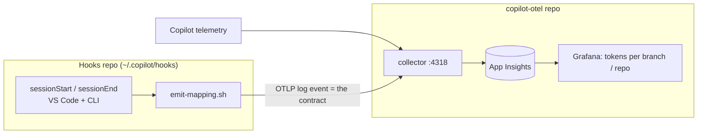

## Overview

This project provisions the Azure side of the Copilot observability stack and configures a local OpenTelemetry collector that forwards VS Code and Copilot CLI telemetry to Application Insights. It uses `azd` for infrastructure and Docker for the collector.

Provisioned resources:

* Log Analytics workspace (30-day retention)
* Workspace-based Application Insights
* Azure Managed Grafana (Standard, system-assigned identity)
* Role assignments: `Monitoring Reader` for the Grafana MSI on the resource group, `Grafana Admin` for the deploying user

## Session-to-story attribution

Beyond raw telemetry, this project supports attributing each Copilot session, and the tokens it consumes, to the work item (git branch) it was spent on. This answers questions like "how many tokens did branch `feature/login` cost?" across VS Code Copilot Chat and the Copilot CLI, even with several projects open at once.

Rather than tagging telemetry globally at the collector (which cannot represent two concurrent sessions), the design keeps two concerns separate: a system-wide Copilot hook emits a lightweight `session -> story` mapping event at each session boundary, and the dashboard joins that mapping to the Copilot telemetry at query time in KQL. The two sides never call each other directly; they meet only at a versioned contract, the shape of the OTLP mapping event. See [docs/session-story-attribution-plan.md](docs/session-story-attribution-plan.md) for the full design, KQL join, and opt-out controls.



## Prerequisites

* [Azure Developer CLI](https://learn.microsoft.com/azure/developer/azure-developer-cli/install-azd) 1.25+
* Azure CLI, logged in (`az login`)
* Docker Desktop
* VS Code with GitHub Copilot; optionally the Copilot CLI

## 1. Provision Azure resources

```bash
git clone https://github.com/YOUR-ORG/copilot-otel.git
cd copilot-otel
azd auth login            # if not already
azd env new copilot-otel  # environment name is used to derive rg-<name>
azd up                    # prompts for subscription + region on first run
```

`azd up` provisions the resource group and everything in [infra/main.bicep](infra/main.bicep). Outputs are written to `.azure/<env>/.env`.

## 2. Export the Application Insights connection string

```bash
export APPLICATIONINSIGHTS_CONNECTION_STRING="$(azd env get-value APPLICATIONINSIGHTS_CONNECTION_STRING)"
export DEPLOYMENT_ENV=dev
```

> [!IMPORTANT]
> Treat the connection string as a secret. Do not commit it.

## 3. Start the local OTEL collector

The collector reads the connection string from the environment, so nothing sensitive lives in [otel-collector-config.yaml](otel-collector-config.yaml).

```bash
docker run -d \
  --name otel-collector \
  --restart unless-stopped \
  -p 4317:4317 -p 4318:4318 \
  -e APPLICATIONINSIGHTS_CONNECTION_STRING \
  -e DEPLOYMENT_ENV \
  -v "$PWD/otel-collector-config.yaml:/etc/otelcol-contrib/config.yaml" \
  otel/opentelemetry-collector-contrib:latest
```

Verify:

```bash
docker logs otel-collector | tail -20
curl -i http://localhost:4318/v1/traces   # 405 Method Not Allowed is expected
```

## 4. Configure VS Code Copilot

Add to your user `settings.json` (Command Palette → `Preferences: Open User Settings (JSON)`):

```json
{
  "github.copilot.chat.otel.enabled": true,
  "github.copilot.chat.otel.exporterType": "otlp-http",
  "github.copilot.chat.otel.otlpEndpoint": "http://localhost:4318",
  "github.copilot.chat.otel.captureContent": true
}
```

Reload the window.

## 5. Configure the Copilot CLI (optional)

Append to `~/.zshrc` (or `~/.bashrc`):

```bash
export COPILOT_OTEL_ENABLED=true
export COPILOT_OTEL_EXPORTER=otlp-http
export COPILOT_OTEL_ENDPOINT=http://localhost:4318
export COPILOT_OTEL_CAPTURE_CONTENT=true
```

Then `source ~/.zshrc`.

## 6. Verify telemetry lands in Application Insights

Trigger a Copilot chat in VS Code, wait 2-5 minutes, then in the Azure portal open the App Insights resource → **Logs**:

```kusto
dependencies
| where cloud_RoleName == "copilot-chat"
| take 10
```

## 7. Import the Grafana dashboard

```bash
azd env get-value GRAFANA_ENDPOINT
```

Open the URL, sign in with the same Azure account, then:

1. **Connections → Data sources → Add data source → Azure Monitor**. Authentication is **Managed Identity**. Save & Test.
2. **Dashboards → New → Import → 25053 → Load**. Select the Azure Monitor data source and the App Insights resource, then Import.

## Common operations

```bash
# Update infra
azd provision

# Stream collector logs
docker logs -f otel-collector

# Recreate collector after config change
docker rm -f otel-collector   # then re-run the docker run command

# Tear everything down (deletes the resource group)
azd down --purge
```

## Cost note

Application Insights ingestion is billed per GB (~USD 2.30/GB after the 5 GB monthly free tier). Managed Grafana Standard is billed per active user hour. Run `azd down` when you are done experimenting.

## Contributing

Contributions are welcome. See [CONTRIBUTING.md](CONTRIBUTING.md) for guidelines.

## License

This project is licensed under the MIT License. See [LICENSE](LICENSE) for details.
