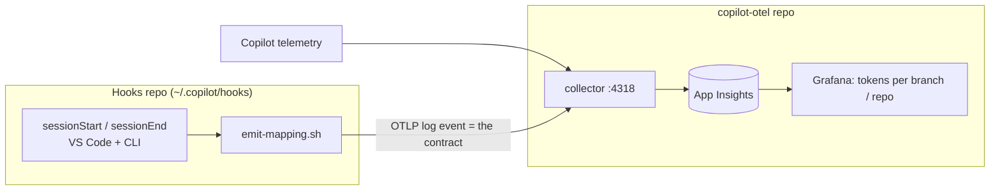

## Goal

Attribute each GitHub Copilot session, and the tokens it consumes, to the work item
(story) it was spent on. The end result is a Grafana view answering questions like
"how many tokens did story `PROJ-123` cost?" across both VS Code Copilot Chat and the
Copilot CLI, even when several projects are open at once.

## Problem with the naive approach

The OpenTelemetry `resource` processor stamps a single value onto every record flowing
through the collector. If two editor windows both send to `localhost:4318`, they share
one pipeline and therefore one `story.id`. A global attribute cannot represent two
concurrent stories, so per-session attribution has to come from somewhere unique to each
source, not from a collector-wide constant.

## Chosen approach: correlate, do not tag globally

Separate two concerns that the naive approach conflated:

| Axis            | Question                                         | Where it is decided        |
| --------------- | ------------------------------------------------ | -------------------------- |
| Stream identity | Which telemetry belongs to which session?        | From an ID unique per source |
| Story tagging   | Which story does that session map to?            | At query time, via a join  |

Rather than tagging telemetry as it is collected, record a `session -> story` mapping at
the session boundary and join it to the Copilot telemetry when the dashboard is rendered.
Because every session already has its own identity, concurrent projects stop being a
collector problem.

## System split across two repos

Two responsibilities, deliberately kept in separate repositories because they have
different lifecycles and owners. The hooks are system-wide (they apply to every Copilot
session on the machine), so they belong with the rest of the personal hook tooling, not
inside this infrastructure project.

| Concern               | Lives in                                                    | Role     | Responsibility                                                            |
| --------------------- | ----------------------------------------------------------- | -------- | ------------------------------------------------------------------------- |
| Hooks + emitter       | Separate hooks repo, deployed to `~/.copilot/hooks/`        | Producer | Detect the session boundary, resolve branch/repo, emit a mapping event    |
| Collector + dashboard | This repo (`copilot-otel`)                                  | Consumer | Receive the event, forward to App Insights, join and visualize in Grafana |

The two sides never call each other directly. They meet only at a single, versioned
**contract**: the shape of the OTLP mapping event. As long as the producer emits that
event and the consumer knows how to read it, either side evolves independently.



## The contract: mapping event

The single interface between the two repos. The producer emits it; the consumer reads it.
It is delivered as an OTLP log record to `localhost:4318`, so it rides the collector this
repo already runs. No new transport, and no secrets on the producer side because the
collector holds the connection string.

| Attribute    | Meaning                                          | Source (producer side)          |
| ------------ | ------------------------------------------------ | ------------------------------- |
| `event`      | `story.session.start` or `story.session.end`     | hook type                       |
| `session.id` | correlation key to Copilot telemetry             | hook JSON payload               |
| `story.id`   | full git branch name                             | `git symbolic-ref --short HEAD` |
| `repo.name`  | working folder name                              | `basename` of the workspace     |
| `workspace`  | absolute workspace path (fallback correlation)   | hook JSON payload               |

Adding a field later is backward-compatible: consumers ignore attributes they do not know.

---

## Part A: Hooks (separate repo)

Producer of mapping events. Everything in this part is owned by the system-wide hooks repo.

### Session boundary: Copilot hooks

Copilot hooks execute shell commands at defined points in an agent session and work in
both the Copilot CLI and VS Code Copilot Chat. Personal hooks live in
`~/.copilot/hooks/*.json`; repository hooks live in `.github/hooks/*.json`. Each hook
receives a JSON payload on stdin describing the session.

The relevant hook types:

- `sessionStart`: fires when a session begins or resumes. This is the natural place to
  open a `session -> story` mapping.
- `sessionEnd`: fires when a session completes. Used to close the window and measure
  session duration.
- `userPromptSubmitted`: optional, if per-prompt granularity is ever needed.

### Story selection

Kept deliberately simple: no prompt, no remote lookup, no ID extraction.

- `story.id` is the **full git branch name**, used as-is
  (`git symbolic-ref --short HEAD`).
- `repo.name` is the **working folder name** (`basename` of the workspace), not the git
  remote.

```bash
repo=$(basename "$workspace")
story_id=$(git -C "$workspace" symbolic-ref --short HEAD 2>/dev/null)
```

Rolling several branches up into a single story, or pulling a work-item key out of the
branch, can be done later at **query time** in KQL. Nothing about that needs to be decided
now, and the collection path does not change when it is.

### Opt-out of tagging

Because every tag comes from the mapping event alone, opting out is simply not emitting it.
The base Copilot telemetry keeps flowing untouched, so only the custom tags disappear.
`emit-mapping.sh` checks three signals at the top and exits `0` (silent no-op) if any says
off. Default is on.

```bash
# 1. Per-session / per-shell kill switch (quickest)
case "${COPILOT_STORY_TAGGING:-on}" in off|0|false) exit 0 ;; esac

# 2. Machine-wide opt-out
[[ -f "$HOME/.copilot/story-tagging.disabled" ]] && exit 0

# 3. Per-repo opt-out (committable, so a team can exclude a whole repo)
[[ -f "$workspace/.copilot-otel-ignore" ]] && exit 0
```

| Scope                | Mechanism                              | Use it when                                    |
| -------------------- | -------------------------------------- | ---------------------------------------------- |
| This shell / session | `export COPILOT_STORY_TAGGING=off`     | Do not tag this work right now                 |
| This machine         | `touch ~/.copilot/story-tagging.disabled` | Never tag on this laptop                     |
| This repo            | commit `.copilot-otel-ignore`          | This repo is sensitive or personal, exclude it |

### Emitter responsibilities

`emit-mapping.sh` is the whole producer: read the hook JSON on stdin, honor the opt-out
guards, resolve `story.id` (branch) and `repo.name` (folder), and POST one OTLP log record
matching the contract. It never touches the base Copilot telemetry, so an opt-out drops
only the tags, never the token totals.

---

## Part B: Collector and dashboard (this repo)

Consumer of mapping events. Everything in this part is owned by `copilot-otel`.

### Correlation key

A join only works if the mapping row and the Copilot telemetry share a key. Two
candidates, in order of preference:

| Key                     | Works when                                                                       | Concurrency safety                                                                              |
| ----------------------- | -------------------------------------------------------------------------------- | ----------------------------------------------------------------------------------------------- |
| Session ID              | The ID in the hook payload equals the session ID in telemetry `customDimensions` | Perfect: every session is unique                                                                |
| Workspace + time window | The hook provides a workspace path and start/end that the telemetry also carries | Safe across workspaces; ambiguous only for two stories in the same workspace at the same instant |

Session ID is the clean key. Workspace-plus-time is the robust fallback. The exact field
names are unknown until both payloads are inspected (see [Open questions](#open-questions)).

### Injection target: App Insights, not Grafana directly

The mapping is emitted into Application Insights and joined in KQL, rather than pushed to
a separate Grafana datasource.

Reasons:

- Single datasource. The mapping and the Copilot metrics live together, so the join is one
  KQL query against the existing Azure Monitor datasource.
- Reuses the existing pipe. The event arrives as an OTLP log on `localhost:4318` and flows
  through the same collector and `azuremonitor` exporter. No new infrastructure.
- Aggregatable. Records are timestamped and can be summarized by `story_id` for tokens,
  duration, and cost.

Alternatives considered and why they lose:

- A second Grafana datasource (SQL or JSON) forces awkward cross-datasource joins on
  Managed Grafana.
- Grafana annotations are excellent as a visual overlay (a colored band per story on the
  token timeline) but cannot be grouped or aggregated, so they cannot produce the
  tokens-per-story table. They remain a good optional layer on top.

### Join sketch

Field names are provisional until discovery confirms them. A `leftouter` join keeps
opted-out sessions in the totals, bucketed as `(untagged)`, so opting out never loses spend.

```kql
let storyMap = traces
| where customDimensions["event"] == "story.session.start"
| project session_id = tostring(customDimensions["session.id"]),
          story_id   = tostring(customDimensions["story.id"]),   // = branch name
          repo       = tostring(customDimensions["repo.name"]);  // = folder name
customMetrics
| where name in ("copilot.tokens.input", "copilot.tokens.output")
| extend session_id = tostring(customDimensions["session.id"])   // must match storyMap
| join kind=leftouter storyMap on session_id
| extend story_id = iif(isempty(story_id), "(untagged)", story_id),
         repo     = iif(isempty(repo), "(untagged)", repo)
| summarize input  = sumif(value, name == "copilot.tokens.input"),
            output = sumif(value, name == "copilot.tokens.output"),
            total  = sum(value),
            sessions = dcount(session_id)
        by repo, story_id
| order by total desc
```

### Grafana panel

A table (or bar chart) driven by the query above, grouped by `repo` and `story_id`. An
optional second layer posts a Grafana annotation per session for a visual overlay on the
token timeline.

## Open questions

Two payloads must be captured before the components are finalized:

1. The hook JSON. Add a throwaway `sessionStart` hook that appends stdin to a file, trigger
   a chat, and inspect which session and workspace fields are present.
2. The telemetry shape. Query existing data to find the matching key:

   ```kql
   union customMetrics, traces, dependencies
   | where cloud_RoleName startswith "copilot"
   | take 50
   | project itemType, name, cloud_RoleName, customDimensions
   ```

   The result determines whether the session ID lines up (preferred) or whether the
   workspace-plus-time fallback is required.

## Next steps

- Capture the two payloads above.
- Confirm the correlation key.
- Scaffold the hook config, `emit-mapping.sh`, and the Grafana panel against the confirmed
  field names.
